# UFO Hunters

## Overview

UFO Hunters is a 2D arcade-style game developed using the Gosu library in Ruby. The player controls a spaceship and must shoot down incoming invaders and avoid missiles while collecting hearts to gain extra lives. The game features multiple types of enemies, animated explosions, and a scoring system.

<p align="center">
  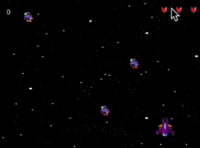
  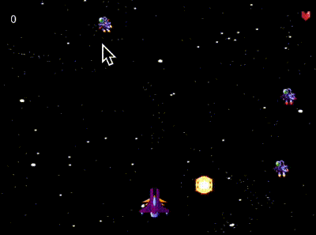
  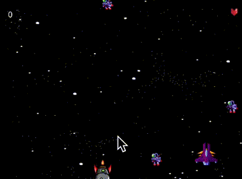
  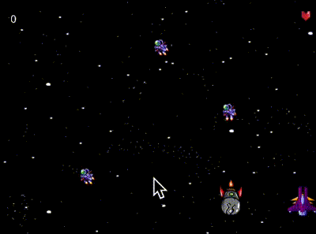 <br />
  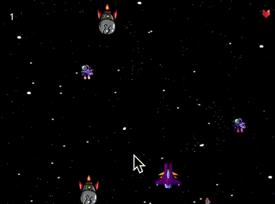
  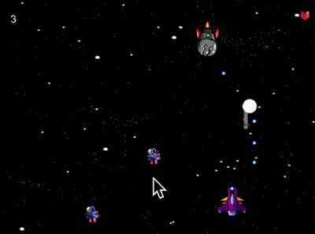
  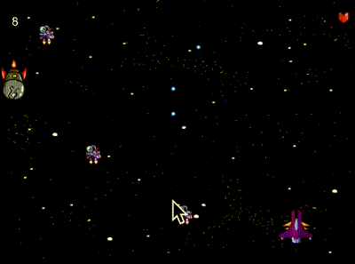
  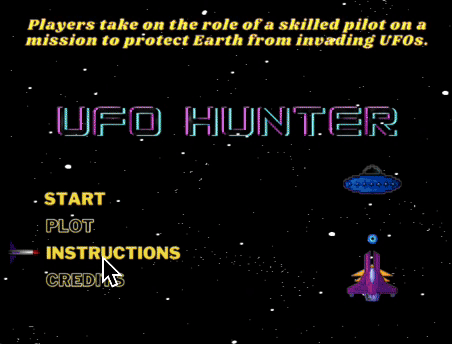 <br />
  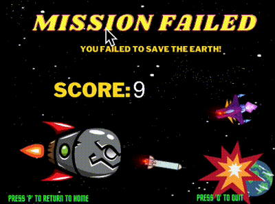
  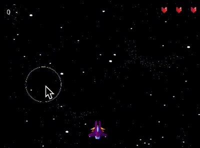
  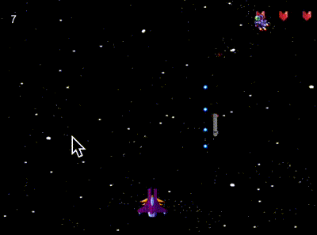
  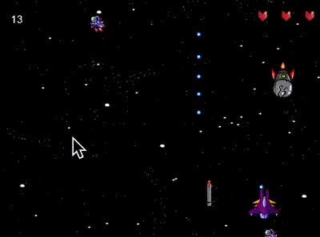 <br />
  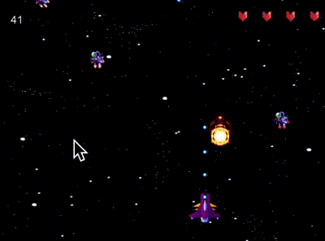
  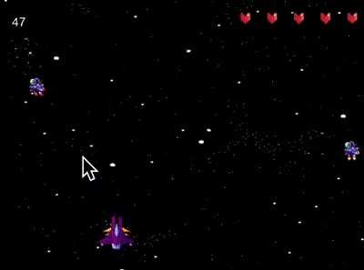
  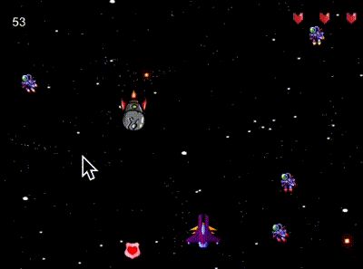
  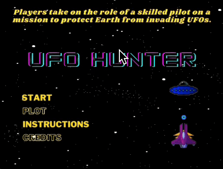 <br />
<i>Sample results</i>
</p>

## Game Mechanics

- **Player**: Control a spaceship to move left and right and shoot bullets.
- **Enemies**: Invaders and invader bosses appear from the top and move downwards. The player must shoot them to earn points.
- **Missiles**: Randomly generated from destroyed invaders, move downwards, and must be avoided.
- **Hearts**: Randomly generated from destroyed invaders, move downwards, and provide extra lives when collected.
- **Explosions**: Animated explosions occur when invaders are destroyed.

## Controls

- **Arrow Keys**: Move the spaceship left and right.
- **Space Bar**: Shoot bullets.
- **P Key**: Play again after game over.
- **Q Key**: Quit the game.

## Installation

1. **Clone the Repository**:
    ```sh
    git clone https://github.com/dan9704/ufo-hunters.git
    cd ufo-hunters
    ```

2. **Install Dependencies**:
    Ensure you have Ruby and Gosu installed. You can install Gosu using the following command:
    ```sh
    gem install gosu
    ```

3. **Run the Game**:
    ```sh
    ruby game.rb
    ```

## Game Features

- **Animated Background**: The background moves to simulate spaceship movement.
- **Multiple Enemy Types**: Includes standard invaders and invader bosses with more health points.
- **Scoring System**: Earn points by shooting invaders.
- **Lives System**: The player starts with 3 lives, and collecting hearts grants additional lives.
- **Game Over Screen**: Displays the final score and allows the player to play again or quit.

## Assets and Sounds

- **Images**: Includes images for the player spaceship, invaders, missiles, hearts, and explosions.
- **Sounds**: Background music, shooting sound, explosion sound, and bonus life sound.

## File Structure

- **main.rb**: Contains the main game logic and window setup.
- **classes.rb**: Defines all game classes including Player, Invader, Missile, Heart, Explosion, etc.
- **images/**: Contains all image assets used in the game.
- **sounds/**: Contains all sound assets used in the game.

## Development

Feel free to fork this repository and make your own modifications to the game. Contributions are welcome!

## License

This project is licensed under the MIT License. See the LICENSE file for details.

